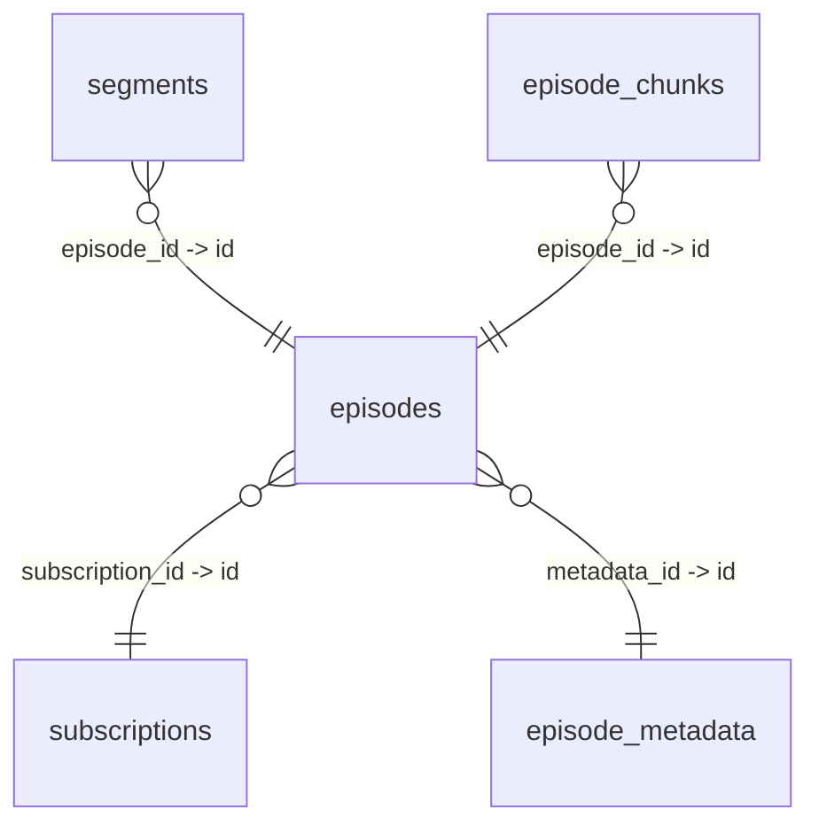

# @m2015agg/supabase-skill

[](https://www.npmjs.com/package/@m2015agg/supabase-skill)
[](https://opensource.org/licenses/MIT)

**The Supabase MCP replacement.** One npm package that teaches AI agents (Claude Code, Codex, Cursor) how to use the Supabase CLI, caches your entire database schema locally with row counts and table sizes, and pre-approves read-only commands so your agent stops asking permission for every lookup.

No MCP server. No context window bloat. No running processes. No permission prompts for reads.

## The Problem

If you're using Claude Code (or any AI agent) with Supabase, you're burning tokens three ways:

**1. The MCP tax** — The Supabase MCP server dumps its entire tool schema into your context window. 30-40% gone before your agent starts thinking.

**2. The schema discovery loop** — Every conversation, your agent runs `SELECT * FROM information_schema.columns` or similar SQL to understand your tables. We measured this across 14 real conversations: **265 schema queries consumed ~330,000 tokens ($4.96 at Opus rates)**. The heaviest single query dumped 22,282 tokens.

**3. The permission prompt hell** — Claude asks "Allow this command?" for every `supabase migration list`, every `supabase inspect db table-stats`, every schema lookup. You click "Allow" 30 times per session.

## The Solution

**Replace the MCP with CLI instructions.** The Supabase CLI already does everything the MCP does. Your agent just doesn't know about it.

**Cache the schema locally.** One API call snapshots your entire database into a local SQLite + FTS5 + markdown cache — with row counts and table sizes. Your agent reads local files (~80 tokens) instead of running SQL queries (~1,247 tokens average).

**Pre-approve read commands.** 23 read-only commands (schema lookups, migration list, inspect, etc.) are auto-approved in Claude Code. Write commands (migration up, deploy, delete) still require your approval.

**Result: ~95% token reduction on schema exploration, zero permission prompts for reads, multi-environment support (dev/stage/prod) in one session.**

## Install

```bash
npm install -g @m2015agg/supabase-skill
```

## Quick Start

### 1. Global Setup (one time)

```bash
supabase-skill install
```

Interactive wizard:
1. Check/install Supabase CLI (minimum v2.67.0)
2. Check/trigger login (opens browser if needed)
3. Discover projects + branches (auto-detects preview branches)
4. Tag each as `prod` / `stage` / `dev` / `skip`
5. Ask for database schema name (default: `public`)
6. Fetch API keys automatically (anon + service_role per environment)
7. Write config to `~/.config/supabase-skill/config.json` (mode 600)
8. Write skill doc to `~/.claude/CLAUDE.md`

```
$ supabase-skill install

  ╔══════════════════════════════════════╗
  ║   supabase-skill setup wizard        ║
  ╚══════════════════════════════════════╝

  Step 1/5: Supabase CLI
    ✓ Found v2.78.1 (minimum: v2.67.0)

  Step 2/5: Authentication
    ✓ Logged in

  Step 3/5: Discovering projects & branches
    1. My App Production (abcdefghijklmnopqrst) ✓
       Checking branches... 1 found
       └─ staging (tsrqponmlkjihgfedcba) ✓

    Tag each environment (prod/stage/dev/skip):
    My App Production → prod
      My App Production [staging] → stage
    Database schema name (default: public) → my_schema

  Step 4/5: Fetching API keys
    PROD ... ✓ anon + service_role keys saved
    STAGE ... ✓ anon + service_role keys saved

  Step 5/5: Writing configuration ✓
```

### 2. Per-Project Setup

```bash
cd your-project
supabase-skill init
```

Runs 5 steps automatically — zero prompts:
1. **CLAUDE.md** — skill doc with environment routing (no secrets)
2. **.env** — API keys per environment (gitignored, mode 600)
3. **Schema snapshot** — SQLite + markdown cache with row counts + table sizes
4. **Claude permissions** — 23 read-only commands pre-approved
5. **Nightly cron** — auto-refresh schema at 3am
6. **`/supabase` walkthrough** — Claude Code skill for guided database tour

Or do both in one shot:

```bash
supabase-skill install --init
```

### 3. First Session

Type `/supabase` in Claude Code for a guided walkthrough of your database. Claude will show your environments, schema overview, explore tables, and teach you what commands are available.

### 4. Validate Setup

```bash
supabase-skill doctor
```

```
  ✓ Supabase CLI — v2.78.1
  ✓ Logged in
  ✓ Config — 2 environment(s): prod, stage
  ✓ API keys [prod] — anon + service_role present
  ✓ API keys [stage] — anon + service_role present
  ✓ Schema — my_schema
  ✓ Project linked — tsrqponmlkjihgfedcba
  ✓ CLAUDE.md — skill doc installed
  ✓ .env — has Supabase keys
  ✓ Snapshot — 0h ago
  ✓ Permissions — 23 commands approved
  ✓ Cron — nightly at 03:00

  12 passed, 0 failed, 0 warnings
```

## Commands

### User Commands (you run these)

| Command | What it does |
|---------|-------------|
| `supabase-skill install` | Global wizard: CLI, login, envs, keys, CLAUDE.md |
| `supabase-skill install --init` | Global + project setup in one shot |
| `supabase-skill init` | Per-project: .env + CLAUDE.md + snapshot + approve + cron + walkthrough |
| `supabase-skill doctor` | Health check: 12-point validation of entire setup |
| `supabase-skill update` | Self-update to latest npm version |
| `supabase-skill update --check` | Check for updates without installing |
| `supabase-skill envs` | Show configured environments |
| `supabase-skill diff` | Compare live schema vs local snapshot (find drift) |
| `supabase-skill graph` | Mermaid ER diagram of all table relationships |
| `supabase-skill cron --status` | Check nightly refresh |
| `supabase-skill uninstall` | Remove from current project |
| `supabase-skill uninstall --global` | Remove from global CLAUDE.md |
| `supabase-skill approve --remove` | Remove Claude permissions |

### Agent Commands (Claude uses these — pre-approved, no prompts)

| Command | What it does |
|---------|-------------|
| `supabase-skill context <query>` | Full context: columns, FKs, related tables (2 levels), functions, row counts, sizes |
| `supabase-skill table <name>` | Single table deep dive with relationships, sizes, related summaries |
| `supabase-skill columns [name]` | Search columns: `--type`, `--fk`, `--pk`, `--nullable`, `--table` |
| `supabase-skill search <query>` | FTS5-powered search across tables, columns, functions, FKs |
| `supabase-skill snapshot` | Refresh schema cache (auto-runs after DDL changes) |
| `supabase inspect db *` | 12 database inspection commands (table-stats, locks, etc.) |
| `supabase migration list` | Compare local vs remote migrations |

## Schema Snapshot (CodeGraph for Your Database)

Instead of your agent running SQL against `information_schema` every time (burning ~1,247 tokens per query), `snapshot` caches everything locally.

```bash
supabase-skill snapshot
```

One API call + one inspect command → full local cache:

```
.supabase-schema/
├── schema.db             # SQLite + FTS5 (fast structured queries)
├── index.md              # All tables with row counts + sizes
├── tables/
│   ├── episodes.md       # Columns, types, PKs, FKs, defaults, notes
│   ├── subscriptions.md
│   └── ... (one file per table + view)
├── relationships.json    # Every FK mapping
└── functions.md          # All RPC functions with parameters
```

### What a Table File Looks Like

```markdown
# episodes

15 columns | 1 PK | 2 FK | ~397 rows | 4216 kB

| Column | Type | Nullable | Default | FK |
|--------|------|----------|---------|-----|
| id **PK** | uuid | NOT NULL | gen_random_uuid() |  |
| subscription_id | uuid | NOT NULL |  | → subscriptions.id |
| status | text | nullable | new |  |
| metadata_id | uuid | nullable |  | → episode_metadata.id |
...
```

### Context — Smart Query (Like CodeGraph)

```bash
supabase-skill context episodes
```

Returns columns, FKs, related tables 2 levels deep, RPC functions, row counts, and sizes — all from local cache.

### Columns — Cross-Database Search

```bash
supabase-skill columns --type jsonb          # all jsonb columns
supabase-skill columns --fk --table episode  # FK columns in episode tables
supabase-skill columns --pk                  # all primary keys
supabase-skill columns status                # find "status" columns
```

### Diff — Detect Schema Drift

```bash
supabase-skill diff
```

Compares live database against local snapshot. Shows tables/columns/functions added or removed since last snapshot.

### Graph — Mermaid ER Diagram

```bash
supabase-skill graph
```

Outputs a mermaid erDiagram of all table relationships. Paste into docs, Notion, or let Claude read it.



## The Skill Doc (20 Sections)

What gets written to CLAUDE.md — every Supabase CLI capability:

| Section | What it teaches the agent |
|---------|-------------------------|
| **CLI Flag Reference** | Which commands use `--linked` vs `--project-ref` |
| **Environment Routing** | "stage" → correct ref, "prod" → approval required |
| **Data Operations (REST API)** | Full CRUD: SELECT with 12 filter operators, INSERT, UPDATE, UPSERT, DELETE, COUNT |
| **Migrations** | `new`, `list`, `up`, `down`, `repair`, `squash`, `fetch` |
| **DDL via Migrations** | CREATE/ALTER/DROP TABLE, VIEW, INDEX, FUNCTION, RLS, triggers, enums |
| **Schema Management** | `db diff`, `dump`, `pull`, `push`, `lint` |
| **Database Inspection** | All 12 `inspect db` commands + `inspect report` |
| **Storage** | `ls`, `cp`, `rm`, `mv` (with `--experimental`) |
| **Edge Functions** | `list`, `deploy`, `delete`, `new`, `download`, `serve` |
| **Branches** | `list`, `create`, `delete`, `get`, `pause`, `unpause` |
| **Backups** | `list`, `restore` (PITR) |
| **Project Management** | `projects list/api-keys`, `secrets`, `postgres-config` |
| **Code Generation** | `gen types` (TypeScript from schema) |
| **Schema Snapshot** | All local query commands |
| **Auto-Refresh** | Freshness check + nightly cron |
| **Safety Rules** | Never mutate prod without approval, test on stage first |

## Security Model

| What | Where | Visible to agent? |
|------|-------|-------------------|
| Project refs | CLAUDE.md | Yes — needed for `--project-ref` |
| Environment routing | CLAUDE.md | Yes — "stage" → which ref |
| API keys (anon + service_role) | `.env` only | Only via `source .env` |
| Config with keys | `~/.config/supabase-skill/config.json` | No — mode 600 |
| Schema snapshot | `.supabase-schema/` | Yes — the whole point |

**Secrets never go in CLAUDE.md.** Agent reads `.env` when it needs direct API access.

## Benchmark Results (Anthropic SkillsBench Format)

Benchmarked against the official Supabase MCP server using Anthropic's SkillsBench evaluation framework. 6 evals × 3 runs each, LLM-graded.

### Speed Comparison

| Eval | With Skill | MCP Server | Speedup |
|------|-----------|------------|---------|
| Schema Lookup | **14.1s** | 14.8s | 1.05x faster |
| Relationship Traversal | **12.4s** | 15.1s | **1.22x faster** |
| Column Search | **11.9s** | 15.4s | **1.29x faster** |
| Function Lookup | 25.2s | **14.3s** | MCP wins (0.56x) |
| Migration Generation | **22.8s** | 41.5s | **1.82x faster** |
| Cross-Table Query | **18.8s** | 28.0s | **1.49x faster** |

**Skill wins 5/6 on speed.** Migration generation is the standout — MCP needs multiple round-trips to understand the schema before writing SQL. The skill has it cached.

### Quality Comparison (LLM-Graded, Anthropic SkillsBench)

| Eval | With Skill | MCP Server | Skill Quality | MCP Quality |
|------|-----------|------------|---------------|-------------|
| Schema Lookup | 1/3 pass | 0/3 pass | 3.3/5 | 1.0/5 |
| Relationship Traversal | 0/3 pass | 0/3 pass | 2.3/5 | 1.0/5 |
| Column Search | **3/3 pass** | 2/3 pass | **5.0/5** | 2.7/5 |
| Function Lookup | **3/3 pass** | 3/3 pass | **5.0/5** | 2.7/5 |
| Migration Generation | **3/3 pass** | 1/3 pass | **5.0/5** | 2.3/5 |
| Cross-Table Query | **3/3 pass** | 1/3 pass | **5.0/5** | 2.3/5 |

**Overall: Skill 13/18 pass (72%) vs MCP 7/18 pass (39%).** Average quality: **4.3/5 vs 2.0/5.**

The skill dominates on complex tasks (migration generation, cross-table queries) where cached schema context lets the agent write correct SQL on the first try. MCP struggles because it needs multiple API round-trips to gather the same context.

### Real-World Weekly Usage Data

Measured from 41 Claude Code sessions over 7 days on a production project (62 tables, 48 RPCs, 86 FKs):

**MCP Usage (before supabase-skill):**
- 293 `execute_sql` calls
- 62 `list_tables` calls
- 355 total MCP calls/week across 41 sessions

**Token Savings:**

| Metric | MCP (current) | With Skill | Weekly Savings |
|--------|--------------|------------|----------------|
| Schema lookups | 62 × 3,500 tokens | 62 × 200 tokens | **204,600 tokens (94%)** |
| SQL queries | 293 × 275 tokens | 293 × 50 tokens | **65,925 tokens (82%)** |
| **Total tokens** | **~330K/week** | **~60K/week** | **~270K tokens/week** |
| Time per call | ~30s avg | ~18s avg | **71 min/week** |
| **Cost (Opus $15/M)** | **~$7.20/week** | **~$1.11/week** | **~$26/month saved** |

### Per-Query Token Savings

| Query Type | MCP Tokens | Skill Tokens | Savings |
|-----------|-----------|-------------|---------|
| "What columns does X have?" | ~1,200 | ~80 | **93%** |
| "Find all jsonb columns" | ~3,000 | ~200 | **93%** |
| "What references X?" | ~2,000 | ~150 | **92%** |
| "Show me the full schema" | ~22,000 | ~500 | **98%** |

### Monthly Projection

| Metric | MCP | With Skill | Saved |
|--------|-----|------------|-------|
| Tokens | 1.32M | 240K | **1.08M tokens** |
| Cost (Opus) | $28.80 | $4.44 | **$24.36/month** |
| Time spent waiting | ~5 hours | ~3 hours | **~2 hours/month** |
| Permission prompts | ~1,200 | 0 | **1,200 clicks saved** |

> **Methodology:** Usage data from Claude Code conversation logs (`.claude/projects/` JSONL files). Benchmark runs via `claude -p` with `--model sonnet`. Grading via Claude LLM grader following Anthropic SkillsBench spec. Raw data in `benchmarks/`.

## Why CLIs Beat MCP for Agents

| | MCP Server | supabase-skill |
|---|---|---|
| **Context overhead** | 30-40% consumed by schema | Zero |
| **Schema exploration** | ~1,247 tokens per query | ~80-200 tokens per file read |
| **Multi-environment** | One database per server | `--project-ref` switches instantly |
| **Runtime** | Server process in background | No process — `exec` calls |
| **Permission prompts** | Every command | 23 read commands pre-approved |
| **Schema freshness** | Always live (expensive) | Cached + nightly cron |
| **Composability** | None | Pipe with `jq`, `grep`, etc. |
| **Health check** | None | `doctor` validates 12 checks |
| **Schema drift** | None | `diff` detects changes |
| **ER diagrams** | None | `graph` outputs mermaid |

## Requirements

- Node.js 18+
- [Supabase CLI](https://supabase.com/docs/guides/cli/getting-started) v2.67.0+ (wizard installs it if missing)
- Supabase account with at least one project

## Uninstall

```bash
supabase-skill uninstall --global   # remove from ~/.claude/CLAUDE.md
supabase-skill uninstall            # remove from current project
supabase-skill approve --remove     # remove Claude permissions
supabase-skill cron --remove        # remove nightly cron
npm uninstall -g @m2015agg/supabase-skill
```

## License

MIT
